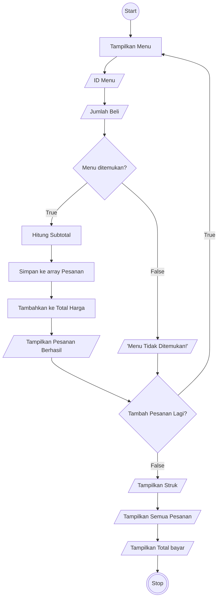
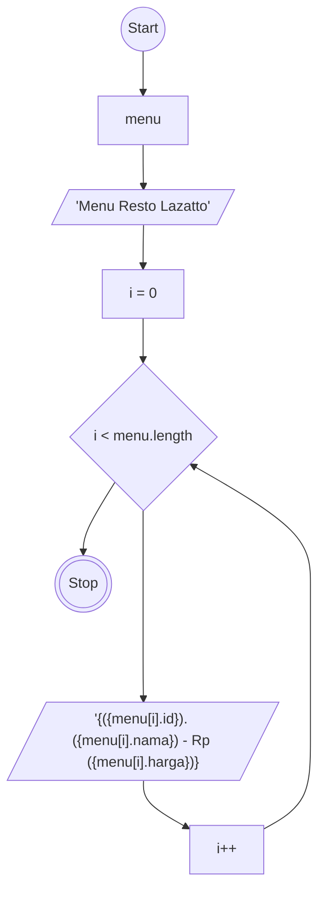

# Program Interaktif Pemesanan Makanan

## Flowchart Programnya

```mermaid

    flowchart TD

    a@{ shape: circle, label: "Start"}
    b@{ shape: rect, label: "Tampilkan Menu"}
    c@{ shape: lean-r, label: "ID Menu"}
    d@{ shape: lean-r, label: "Jumlah Beli"}
    e@{ shape: diamond, label: "Menu ditemukan?"}
    f@{ shape: rect, label: "Hitung Subtotal" }
    g@{ shape: rect, label: "Simpan ke array Pesanan" }
    h@{ shape: rect, label: "Tambahkan ke Total Harga" }
    i@{ shape: lean-r, label : "Tampilkan Pesanan Berhasil"}
    z@{ shape: lean-r, label : "'Menu Tidak Ditemukan!'"}
    j@{ shape: diamond, label: "Tambah Pesanan Lagi?"}
    k@{ shape: lean-r, label : "Tampilkan Struk"}
    l@{ shape: lean-r, label : "Tampilkan Semua Pesanan"}
    m@{ shape: lean-r, label : "Tampilkan Total bayar"}
    n@{ shape: dbl-circ, label: "Stop"}

    a-->b-->c-->d-->e
    e--True-->f-->g-->h-->i-->j
    e--False-->z-->j
    j--True-->b
    j--False-->k-->l-->m-->n


```

## Flowchart Tampilkan Menu

```mermaid

    flowchart TD

    a@{ shape: circle, label: "Start"}
    z@{ shape: rect, label: "menu"}
    b@{ shape: lean-r, label: "'Menu Resto Lazatto'"}
    c@{ shape: rect, label: "i = 0" }
    d@{ shape: diamond, label: "i < menu.length"}
    e@{ shape: lean-r, label : "'{({menu[i].id}). ({menu[i].nama}) - Rp ({menu[i].harga})}"}
    f@{ shape: rect, label: "i++" }
    g@{ shape: dbl-circ, label: "Stop"}

    a-->z-->b-->c-->d-->g

    d---->e-->f
    f-->d


```
