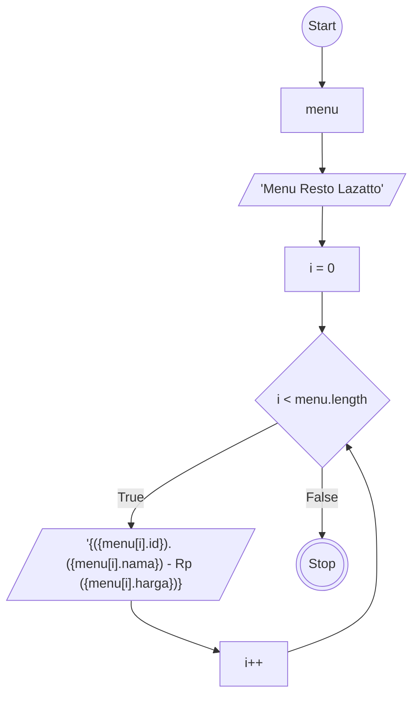

# Program Interaktif Pemesanan Makanan

## Flowchart Tampilkan Menu

```mermaid

    flowchart TD

    a@{ shape: circle, label: "Start"}
    z@{ shape: rect, label: "menu"}
    b@{ shape: lean-r, label: "'Menu Resto Lazatto'"}
    c@{ shape: rect, label: "i = 0" }
    d@{ shape: diamond, label: "i < menu.length"}
    e@{ shape: lean-r, label : "'{({menu[i].id}). ({menu[i].nama}) - Rp ({menu[i].harga})}"}
    f@{ shape: rect, label: "i++" }
    g@{ shape: dbl-circ, label: "Stop"}

    a-->z-->b-->c-->d--False-->g

    d--True-->e-->f
    f-->d


```
